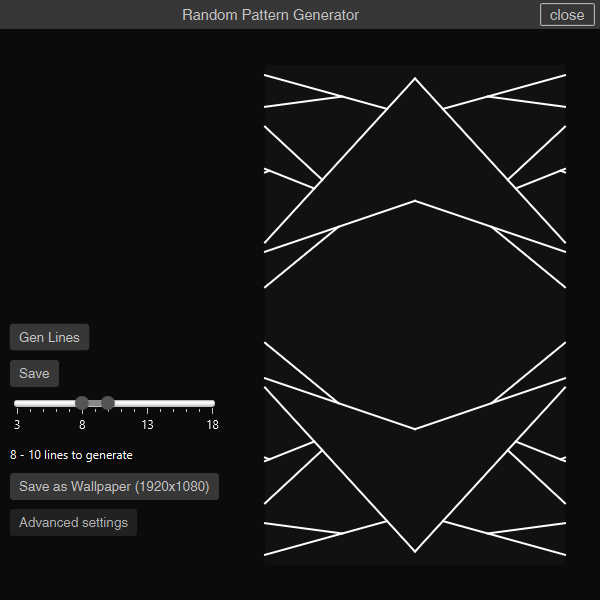
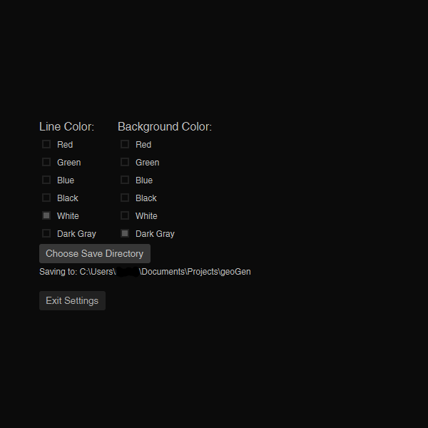

# geoGen
geometric pattern generator in java

-	looks pretty

-	allows the user to save the pattern as is, or scale it to fit a 1920x1080 desktop (more sizes coming eventually(?))

-	allows the user to customize the color of the lines and background (limited options available!!)

# Known Issues
-	.jar may not run on some systems (my own included). may require the user to build from source files as necessary
-	saving multiple patterns to wallpaper size stacks them on top of each other (easy fix but I'm kinda busy with other things atm)